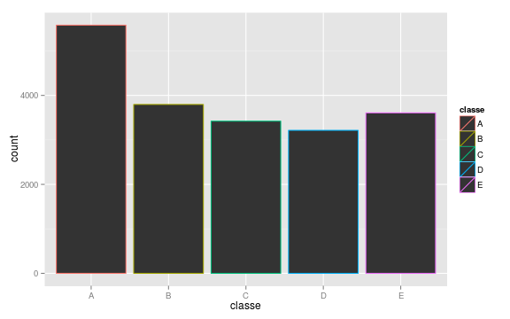
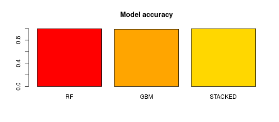
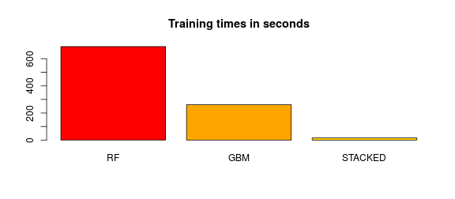

<!-- R Commander Markdown Template -->

###  Question : 
#### How to predict the quality of weight lifting exercise using accelerometer record ? 


##### data.analysis@numericable.fr         


### The Dataset
The research question is relevant to the dataset collected on five different people when performing weight lifting exercises.
>
<a href="http://groupware.les.inf.puc-rio.br/har" target="_blank">Dataset homepage and closer explanations are here</a>


* Please notice that every call for libraries are integrated to the .Rmd header, so they do not appear in the html file.

1) Ensure you have the dataset in your working directory with **getwd()** command, then :

```r
> set.seed(333)
> DF<-read.csv("pml-training.csv")
```
2) get rid of variables without variability and too much of NA's :

```r
> nsv <- nearZeroVar(DF,saveMetrics=TRUE)
> s<-c(rownames(subset(nsv,nzv=="FALSE" & zeroVar=="FALSE")))
> DFF<-subset(DF, select=s)
> DF2<-as.data.frame(apply(DFF,2,FUN=function(x) sum(x=="NA"|x=="0")))
> D<-c(rownames(subset(DF2,!DF2=="NA"|DF2=="0")))
> DFF<-subset(DFF, select=D)
```
3) get rid of some useless variables, as we do not need to know timestamps and participant ID's :


```r
> DFF<-DFF[,-c(1:5)]
```

4) Once we have preprocessed, the resulting dataframe contains 54 variables implying 53 predictors:

```r
> dim(DFF)
```

```
[1] 19622    54
```

### The outcome variable
Obviously, every exercise result is classified from good to bad manner. A stillstanding research question from above resumes itself in the five-type outcome of the categorical variable " classe " :


```r
> qplot(classe,colour=classe,data=DFF)
```


### The question solving approach

At first sight, there are two possible approaches to solve the problem :
* A choice between two model based solutions
* Model stacking in order to improve accuracy 

In any of the cases, the solution will be evaluated on the basis of the :

* Time of the execution, to ensure a good scalability
* Evaluated accuracy, impacting both ISE and OSE errors.

A split of the training dataset is here : 


```r
> inTrain = createDataPartition(DFF$classe, p = 3/4)[[1]]
> training = DFF[ inTrain,]
> testing = DFF[-inTrain,]
```

#### 1) Two separate model based Approach 

Every computation uses the **doMC** library, setted on 4 cores of my AMD 10. Please notice that **doMC** is not available in Windows environment. 

As the dataset appears to do not suit the purpose of linear modelization, I have chosen two algorithms, both well known for their nonlinear
performances : Random Forest and gbm. I have setted the cross validation arbitrarily on 5 but, regarding to the number of records in the dataframe,
any number between 5 and 10 will perform very well.


```r
> registerDoMC(4)
> 
> control <- trainControl(method="cv", number=5 )
> 
> system.time(RF1<-train(classe ~.,data = training, method="rf",trControl=control))
```

```
utilisateur     système      écoulé 
   1453.574      15.757     671.227 
```

```r
> system.time(GBM2<-train(classe ~.,data = training, method="gbm",verbose=F,trControl=control))
```

```
utilisateur     système      écoulé 
   1027.609      10.050     246.250 
```

Here comes the prediction and its evaluated results :


```r
> system.time(P1<-predict(RF1,newdata=testing))
```

```
utilisateur     système      écoulé 
      0.484       0.001       0.486 
```

```r
> system.time(P2<-predict(GBM2,newdata=testing))
```

```
utilisateur     système      écoulé 
      0.277       0.000       0.278 
```

```r
> confusionMatrix(testing$classe,P1)
```

```
Confusion Matrix and Statistics

          Reference
Prediction    A    B    C    D    E
         A 1395    0    0    0    0
         B    6  943    0    0    0
         C    0    0  855    0    0
         D    0    0    1  803    0
         E    0    0    0    2  899

Overall Statistics
                                          
               Accuracy : 0.9982          
                 95% CI : (0.9965, 0.9992)
    No Information Rate : 0.2857          
    P-Value [Acc > NIR] : < 2.2e-16       
                                          
                  Kappa : 0.9977          
 Mcnemar's Test P-Value : NA              

Statistics by Class:

                     Class: A Class: B Class: C Class: D Class: E
Sensitivity            0.9957   1.0000   0.9988   0.9975   1.0000
Specificity            1.0000   0.9985   1.0000   0.9998   0.9995
Pos Pred Value         1.0000   0.9937   1.0000   0.9988   0.9978
Neg Pred Value         0.9983   1.0000   0.9998   0.9995   1.0000
Prevalence             0.2857   0.1923   0.1746   0.1642   0.1833
Detection Rate         0.2845   0.1923   0.1743   0.1637   0.1833
Detection Prevalence   0.2845   0.1935   0.1743   0.1639   0.1837
Balanced Accuracy      0.9979   0.9992   0.9994   0.9986   0.9998
```

```r
> confusionMatrix(testing$classe,P2)
```

```
Confusion Matrix and Statistics

          Reference
Prediction    A    B    C    D    E
         A 1395    0    0    0    0
         B   10  934    5    0    0
         C    0    9  844    2    0
         D    0    7   14  782    1
         E    0    4    0    8  889

Overall Statistics
                                          
               Accuracy : 0.9878          
                 95% CI : (0.9843, 0.9907)
    No Information Rate : 0.2865          
    P-Value [Acc > NIR] : < 2.2e-16       
                                          
                  Kappa : 0.9845          
 Mcnemar's Test P-Value : NA              

Statistics by Class:

                     Class: A Class: B Class: C Class: D Class: E
Sensitivity            0.9929   0.9790   0.9780   0.9874   0.9989
Specificity            1.0000   0.9962   0.9973   0.9946   0.9970
Pos Pred Value         1.0000   0.9842   0.9871   0.9726   0.9867
Neg Pred Value         0.9972   0.9949   0.9953   0.9976   0.9998
Prevalence             0.2865   0.1945   0.1760   0.1615   0.1815
Detection Rate         0.2845   0.1905   0.1721   0.1595   0.1813
Detection Prevalence   0.2845   0.1935   0.1743   0.1639   0.1837
Balanced Accuracy      0.9964   0.9876   0.9876   0.9910   0.9979
```

The predictive performance is very close , only the time of training differs significantly.

#### 1) Model stacking

Simple as that, both previous models ale tied up and verified over the testing split :


```r
> MMDF<-data.frame(P1,P2,classe=testing$classe)
> system.time(STACK<-train(classe~., data=MMDF, method="rf",trControl=control))
```

```
utilisateur     système      écoulé 
    209.447       3.845      14.416 
```

```r
> COMB2<-predict(STACK,testing)
> confusionMatrix(testing$classe,COMB2)
```

```
Confusion Matrix and Statistics

          Reference
Prediction    A    B    C    D    E
         A 1395    0    0    0    0
         B    4  945    0    0    0
         C    0    0  855    0    0
         D    0    0    1  803    0
         E    0    0    0    2  899

Overall Statistics
                                          
               Accuracy : 0.9986          
                 95% CI : (0.9971, 0.9994)
    No Information Rate : 0.2853          
    P-Value [Acc > NIR] : < 2.2e-16       
                                          
                  Kappa : 0.9982          
 Mcnemar's Test P-Value : NA              

Statistics by Class:

                     Class: A Class: B Class: C Class: D Class: E
Sensitivity            0.9971   1.0000   0.9988   0.9975   1.0000
Specificity            1.0000   0.9990   1.0000   0.9998   0.9995
Pos Pred Value         1.0000   0.9958   1.0000   0.9988   0.9978
Neg Pred Value         0.9989   1.0000   0.9998   0.9995   1.0000
Prevalence             0.2853   0.1927   0.1746   0.1642   0.1833
Detection Rate         0.2845   0.1927   0.1743   0.1637   0.1833
Detection Prevalence   0.2845   0.1935   0.1743   0.1639   0.1837
Balanced Accuracy      0.9986   0.9995   0.9994   0.9986   0.9998
```
Stacking does not make an accuracy miracle, but that observation should be verified with other real 
datasets as the more robust stacked model can be less prone to acccumulate out of sample errors.


### The conclusion



```
     RF     GBM STACKED 
 0.9982  0.9878  0.9986 
```


```
     RF     GBM STACKED 
690.070 261.444  16.240 
```
All of the tested model have a pretty high predictive accuracy, way over 95 % .
Obviously, stacking my models does not improve significantly real accuracy over the random forest algorithm itself. 
Nonetheless, this should also be reconsidered seriously when dealing with more datasets, as the stacked algorithm 
is more robust by definition and will absorb the OSE error in better way.
In case of a big data issue, I recommend to use "gbm" boosting solution only,even if it's in sample predictive performance is slightly
less significant. Easy presumable issue is, that a heavy computation required by "rf" algorithm will not scale very well.
This choice takes twice and half of the time more than "gbm" on training with these datas. 


